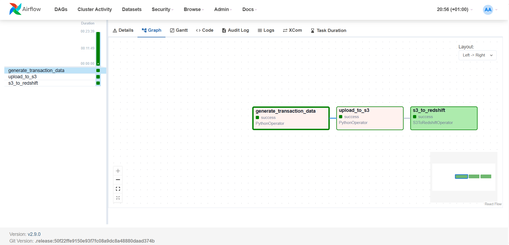

# ShopVerse_Pipeline_Africa

## End-to-End E-Commerce Data Pipeline

This project simulates transactional data for a fictional e-commerce company called **Shopverse Africa**, then builds a complete data pipeline to move that data from generation to analytics-ready storage in **Amazon Redshift**.

Built with:

- Apache Airflow (for orchestration)
- Python + Faker + pandas (for simulation and transformation)
- AWS S3 (for raw storage)
- Amazon Redshift (for data warehousing)
- Terraform (for infrastructure provisioning)
- Docker (for local orchestration)

**Tools Used:**
- **Apache Airflow** (Dockerized)
- **AWS S3** – Data Lake storage
- **Amazon Redshift** – Data warehouse
- **Python + pandas + awswrangler** – For ETL logic

## What the Pipeline Does

### 1. **Generate Transaction Data**
Using the `Faker` library, the pipeline simulates realistic e-commerce transaction records:

- `first_name`, `last_name`, `customer_id`, `product_id`
- `transaction_date`, `payment_method`, `store_location`

Each run creates between **500,000 and 1,000,000 rows**, stored in a `pandas.DataFrame`.

### 2. **Save to S3**
Data is saved in Parquet format to a defined S3 path:
```bash
s3://shopverse-raw/transactions/tran-YYYY-MM-DD.parquet
```

### 3. **Load to Amazon Redshift**
Using Airflow's native `S3ToRedshiftOperator`, the pipeline loads the parquet file into a table called `transactions` under the `public` schema.

Orchestrated with **Airflow DAG** using the following flow:

```python
generate_transaction_data >> write_to_s3 >> s3_to_redshift
```

## How to Run the Project

### 1. **Provision AWS Infrastructure with Terraform**

```bash
cd infrastructure/terraform/
terraform init
terraform apply
```

Creates:
- An S3 bucket: `shopverse-raw`
- A Redshift cluster
- Relevant IAM roles
- A VPC and its stacks

### 2. **Start Airflow (Docker)**

```bash
docker-compose up airflow-init
docker-compose up
```

### 3. **Set Airflow Connections**
```bash

From the Airflow UI (`http://localhost:8080`), go to **Admin > Connections** and add your credentials.
```

## DAG Logic

The DAG file (`extract_to_s3_dag.py`) defines:

- `generate_transaction_data`: creates fake transaction data
- `upload_to_s3`: writes it to Parquet in S3
- `s3_to_redshift`: uses `S3ToRedshiftOperator` to load data into the `transactions` table

Redshift COPY is configured using:
```python
copy_options = ["FORMAT AS PARQUET"]
```

---


